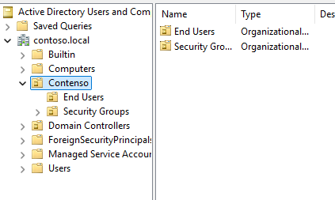
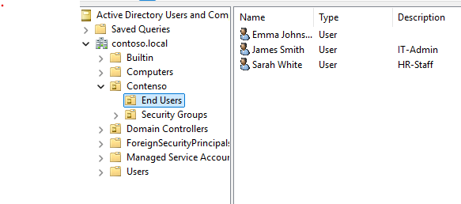
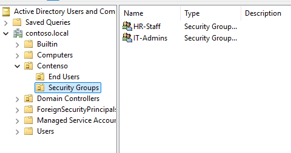

# Active Directory Konfiguration

## Übersicht

Auf Server01 wurde Active Directory Domain Services (AD DS) installiert 
und die Domäne `contoso.local` eingerichtet. Zur besseren Strukturierung 
wurde eine eigene Organisationseinheit (OU) "Contenso" angelegt, anstatt 
Benutzer im Standard-Users-Container zu belassen.

## OU-Struktur

- **Contenso**
  - **End Users** – enthält alle Benutzerkonten
  - **Security Groups** – für gruppenbasierte Berechtigungsvergabe

Diese Trennung ermöglicht eine gezielte Anwendung von Gruppenrichtlinien 
(GPOs) auf OU-Ebene sowie eine saubere Delegation von Berechtigungen.

## Testbenutzer

Zur Validierung der Struktur wurden drei Testbenutzer mit unterschiedlichen 
Rollen angelegt:

| Name | Typ | Beschreibung |
|------|-----|--------------|
| Emma Johnson | User | – |
| James Smith | User | IT-Admin |
| Sarah White | User | HR-Staff |

## Security Groups

Statt Berechtigungen direkt auf einzelne User zu vergeben, wurden 
rollenbasierte Security Groups angelegt. Berechtigungen und GPOs werden 
künftig über diese Gruppen gesteuert, nicht direkt am Benutzerkonto – 
das vereinfacht die Verwaltung erheblich, sobald mehr User dazukommen.

- **IT-Admins**
- **HR-Staff**

## Verwendete PowerShell-Befehle

