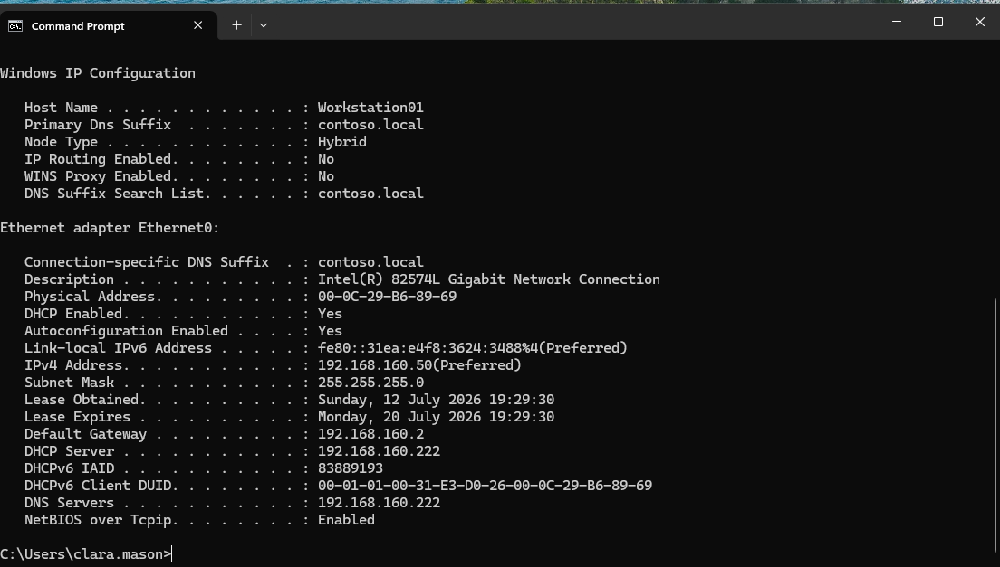

# DHCP Server Setup - Windows Server (contoso.local)

## Überblick
DHCP-Rolle auf SERVER01 (Domain Controller) eingerichtet,  zur Automatisuerung der IP-Vergabe im Netzwerk

## Konfiguration
- **Scope-Name:** Lab_Network
- **IP-Bereich:** 192.168.160.50 - 192.168.160.99
- **Lease-Dauer:** 8 Tage

## Durchgeführte Schritte
1. DHCP-Rolle über Server Manager installiert
2. Neuen Scope erstellt mit obigem IP-Bereich
3. DHCP-Lease auf der VM deaktiviert
4. Test: Client-PC(Workstation01) per `ipconfig /release` und `ipconfig /renew`

## Learnings / Troubleshooting
Beim ersten Test bekam der Client eine IP von **192.168.160.130** mit DHCP-Server **192.168.160.254** - das war nicht mein SERVER01-DHCP, sondern VMware's eigener virtueller DHCP-Dienst für das NAT-Netzwerk

**Lösung:**
Im VMware Virtual Network Editor (Edit -> Virtual Network Editor) die Option "Use local DHCP service to distribute IP address to VMs". Nach erneutem `ipconfig /release` / `renew` kam die IP korrekt aus dem eigenen Scope(192.168.160.50), inklusive korrektem DNS-Suffix contoso.local.

## Screenshots

