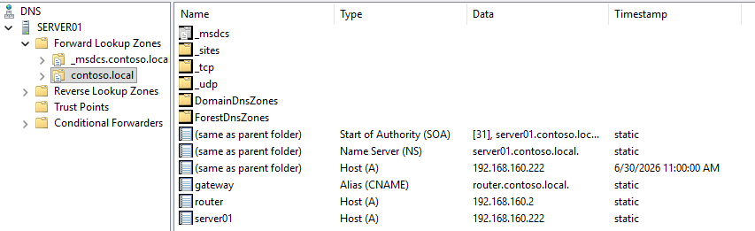
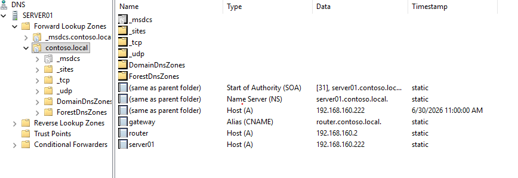
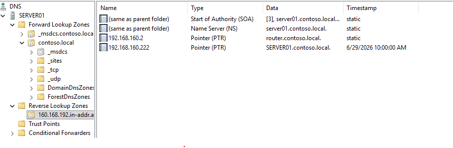

# DNS-Konfiguration

## Übersicht

Auf Server01 wurde der DNS-Server als integraler Bestandteil der 

Active-Directory-Domäne `contoso.local` eingerichtet. Sowohl eine 

Forward Lookup Zone als auch eine Reverse Lookup Zone wurden konfiguriert.

## Forward Lookup Zone (contoso.local)

Enthält folgende Einträge:

\- **SOA \& NS Records** – automatisch generiert für die Domäne

\- **Host (A) Records:**

&#x20; - `server01` → 192.168.160.222

&#x20; - `router` → 192.168.160.2

\- **Alias (CNAME):**

&#x20; - `gateway` → router.contoso.local

## Reverse Lookup Zone (160.168.192.in-addr.arpa)

Zusätzlich zur Forward Zone wurde eine Reverse Lookup Zone eingerichtet, 

um IP-zu-Name-Auflösung zu ermöglichen (wichtig z.B. für Logging und 

Troubleshooting).

\- **PTR Records** für server01 und router, passend zu den Forward-Einträgen

