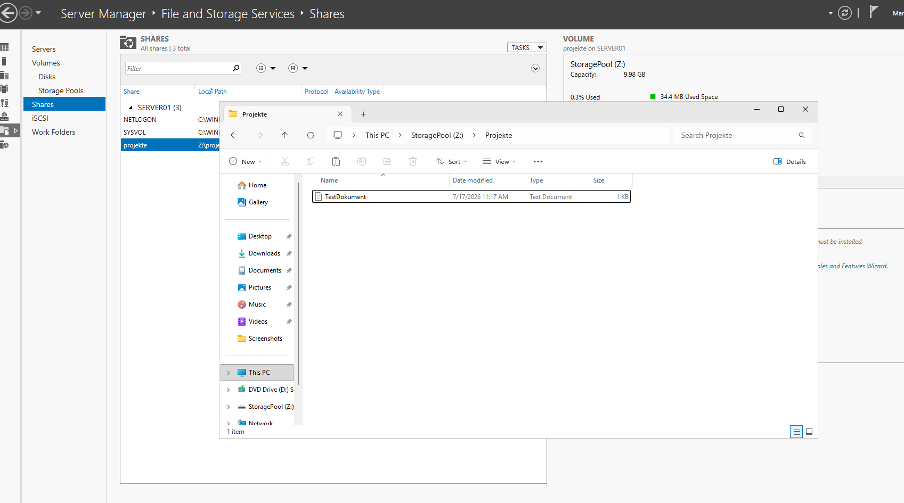
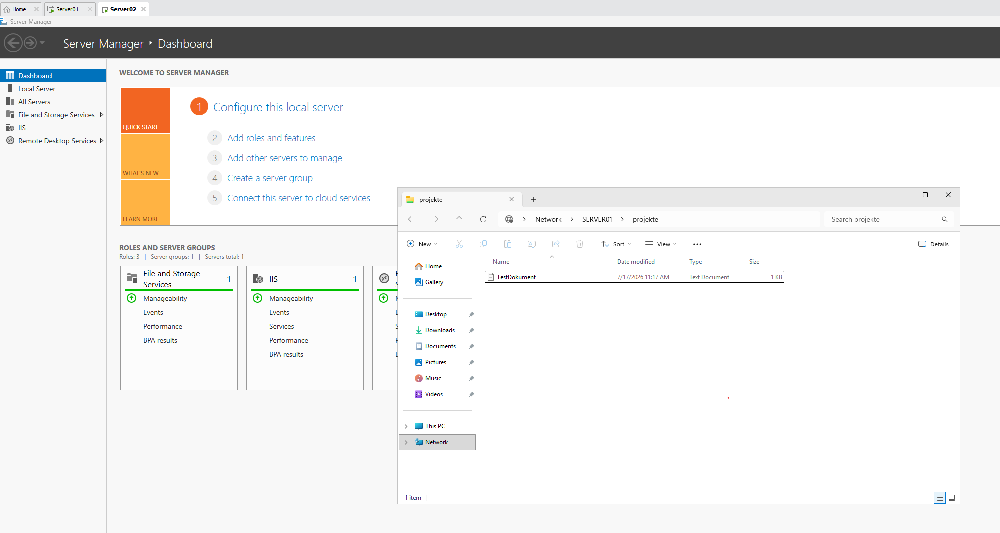
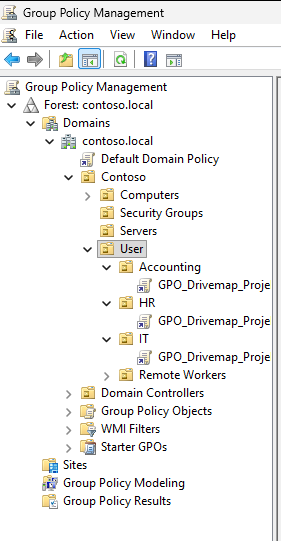
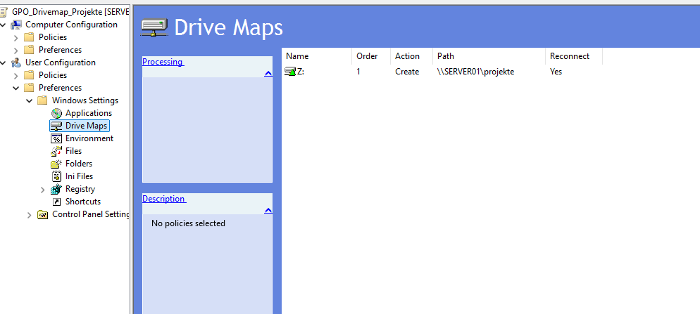
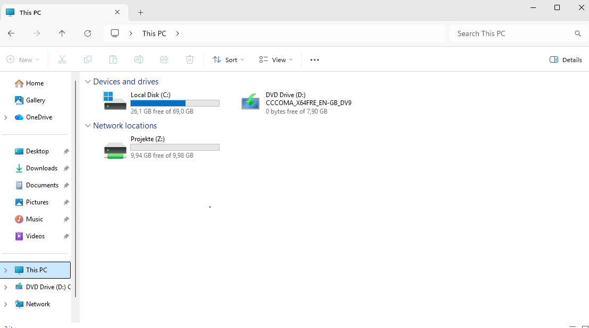

# File-Server-Rolle

## Übersicht

Die File-Server-Rolle ermöglicht es, Dateien und Ordner zentral im Netzwerk bereitzustellen. Dabei können SMB-Freigaben erstellt und Zugriffsberechtigungen für Benutzer und Gruppen festgelegt werden.

Für den Zugriff sind zwei Berechtigungsebenen relevant:

- Freigabeberechtigungen der SMB-Freigabe
- NTFS-Berechtigungen des Ordners

Die tatsächlich verfügbaren Rechte ergeben sich aus der jeweils restriktiveren Berechtigung.

---

## Installation der File-Server-Rolle

1. Im **Server Manager** oben rechts auf **Manage** klicken.
2. **Add Roles and Features** auswählen.
3. Im Assistenten zu **Server Roles** wechseln.
4. Folgenden Pfad öffnen:

```text
File and Storage Services
└── File and iSCSI Services
    └── File Server
```

Die File-Server-Rolle ist bei Windows Server normalerweise bereits installiert. In diesem Fall sind keine weiteren Schritte notwendig.

---

## Erstellen eines freigegebenen Ordners

1. Auf dem gewünschten Volume einen neuen Ordner erstellen.

In meinem Fall:

```text
Z:\projekte
```

2. Im **Server Manager** zu folgendem Bereich wechseln:

```text
File and Storage Services → Shares
```

3. Oben rechts auf **Tasks → New Share** klicken.
4. Als Freigabeprofil **SMB Share – Quick** auswählen.
5. Das gewünschte Volume und den Ordner auswählen.
6. Einen Freigabenamen und optional eine Beschreibung vergeben.

In meinem Fall:

```text
Freigabename: projekte
Netzwerkpfad: \\SERVER01\projekte
```

7. Die gewünschten SMB-Einstellungen auswählen.
8. Die Option **Allow caching of share** kann bei Bedarf aktiviert werden.
9. Unter **Permissions** auf **Customize permissions** klicken.
10. Die Gruppe `CONTOSO\Domain Users` hinzufügen.
11. Folgende NTFS-Berechtigungen vergeben:

```text
Read & execute
List folder contents
Read
Write
```

Damit dürfen Domänenbenutzer den Ordner öffnen, Dateien lesen, neue Dateien erstellen und vorhandene Dateien bearbeiten.

> **Hinweis:** Für ein realistischeres Berechtigungskonzept sollte in der Praxis nicht pauschal die gesamte Gruppe `Domain Users` mit Schreibzugriff versehen werden. Sinnvoller ist eine differenzierte Gruppenstruktur (z. B. `projekte-lesen` und `projekte-schreiben`), um Zugriffsrechte nach dem Prinzip der geringsten Rechte zu vergeben.

---

## Access-based Enumeration (ABE)

Access-based Enumeration sorgt dafür, dass Benutzer in einer Freigabe nur die Dateien und Ordner **sehen**, auf die sie tatsächlich Zugriff haben. Ohne ABE sehen Benutzer alle Objekte in der Freigabe, erhalten aber beim Öffnen eine "Access Denied"-Meldung, falls die Berechtigung fehlt.

ABE lässt sich pro Freigabe über PowerShell aktivieren:

```powershell
Set-SmbShare -Name projekte -FolderEnumerationMode AccessBased
```

Der aktuelle Status kann überprüft werden mit:

```powershell
Get-SmbShare -Name projekte | Select-Object Name, FolderEnumerationMode
```

ABE ist besonders in Umgebungen mit vielen unterschiedlichen Berechtigungsgruppen sinnvoll, da es die Übersichtlichkeit für Benutzer verbessert und ungewollte Einblicke in Ordnerstrukturen verhindert, auf die kein Zugriff besteht.

---

## Überprüfen der Freigabe

Die vorhandenen SMB-Freigaben können auf `SERVER01` mit PowerShell überprüft werden:

```powershell
Get-SmbShare
```

Die Freigabeberechtigungen werden mit folgendem Befehl angezeigt:

```powershell
Get-SmbShareAccess -Name projekte
```

Die NTFS-Berechtigungen des Ordners können mit folgendem Befehl geprüft werden:

```powershell
Get-Acl Z:\projekte | Format-List
```

---

## Testen des freigegebenen Ordners

Der Zugriff wird von einer anderen Maschine getestet. In meinem Homelab verwende ich dafür `SERVER02`.

Im Datei-Explorer wird folgender UNC-Pfad eingegeben:

```text
\\SERVER01\projekte
```

Alternativ kann der Zugriff mit PowerShell geprüft werden:

```powershell
Test-Path \\SERVER01\projekte
```

Bei erfolgreichem Zugriff wird folgendes Ergebnis ausgegeben:

```text
True
```

Anschließend wird im freigegebenen Ordner eine Textdatei erstellt. Dadurch wird geprüft, ob nicht nur Lese-, sondern auch Schreibberechtigungen vorhanden sind.

---

## Netzlaufwerk verbinden (manuell)

1. Im Datei-Explorer zu **This PC** wechseln.
2. Über die drei Punkte **Map network drive** auswählen.
3. Einen freien Laufwerksbuchstaben auswählen, beispielsweise `Z:`.
4. Unter **Folder** den Netzwerkpfad eintragen:

```text
\\SERVER01\projekte
```

5. Optional **Reconnect at sign-in** aktivieren.
6. Mit **Finish** bestätigen.

Alternativ kann das Netzlaufwerk über PowerShell oder die Eingabeaufforderung verbunden werden:

```powershell
net use Z: \\SERVER01\projekte
```

Falls die aktuelle Anmeldung keine Berechtigung besitzt, kann ein Domänenkonto angegeben werden:

```powershell
net use Z: \\SERVER01\projekte /user:CONTOSO\Administrator *
```

Das Kennwort wird anschließend verdeckt abgefragt.

Für einen realistischen Berechtigungstest sollte nach Möglichkeit ein normaler Domänenbenutzer statt des Domänenadministrators verwendet werden.

Beispiel:

```powershell
net use Z: \\SERVER01\projekte /user:CONTOSO\Benutzername *
```

---

## Netzlaufwerk automatisiert per GPO verbinden

In einer echten Unternehmensumgebung wird das Netzlaufwerk in der Regel nicht manuell auf jedem Client eingerichtet, sondern zentral über eine Gruppenrichtlinie (GPO) verteilt.

1. **Group Policy Management** öffnen.
2. Ein neues GPO erstellen oder ein bestehendes GPO bearbeiten und mit der gewünschten OU verknüpfen (z. B. der OU `Remote Workers`).
3. Im **Group Policy Management Editor** zu folgendem Pfad wechseln:

```text
User Configuration
└── Preferences
    └── Windows Settings
        └── Drive Maps
```

4. Rechtsklick auf **Drive Maps → New → Mapped Drive**.
5. Folgende Einstellungen vornehmen:

```text
Action:    Create
Location:  \\SERVER01\projekte
Drive Letter: P (use first available / spezifischer Buchstabe)
Label as:  Projekte
Reconnect: aktiviert
```

6. Optional unter **Common** die Option **Item-level targeting** nutzen, um das Mapping nur für bestimmte Benutzer oder Gruppen anzuwenden.
7. Das GPO speichern und auf den Clients per

```powershell
gpupdate /force
```

aktualisieren, oder den nächsten automatischen Richtlinien-Refresh abwarten.

Der Vorteil gegenüber der manuellen Methode: Neue Benutzer in der betroffenen OU erhalten das Laufwerk automatisch bei der Anmeldung, ohne dass eine manuelle Konfiguration auf jedem Client notwendig ist.

---

## Fehleranalyse

Falls der Zugriff auf die Freigabe nicht funktioniert, können folgende Prüfungen durchgeführt werden.

### DNS-Auflösung prüfen

```powershell
nslookup SERVER01
```

### Netzwerkverbindung prüfen

```powershell
ping SERVER01
```

### SMB-Port prüfen

```powershell
Test-NetConnection SERVER01 -Port 445
```

### Freigabe testen

```powershell
Test-Path \\SERVER01\projekte
```

### Freigaben auf dem Server anzeigen

```powershell
Get-SmbShare
```

### Berechtigungen überprüfen

```powershell
Get-SmbShareAccess -Name projekte
```

```powershell
Get-Acl Z:\projekte | Format-List
```

In meinem Fall waren DNS-Auflösung, Netzwerkverbindung und SMB-Port erreichbar. Der Zugriff funktionierte zunächst nicht, weil auf `SERVER02` ein lokales Konto verwendet wurde.

Nach der Anmeldung mit einem Domänenkonto konnte das Netzlaufwerk erfolgreich verbunden werden:

```powershell
net use P: \\SERVER01\projekte /user:CONTOSO\Administrator *
```

---

## Ergebnis

Die SMB-Freigabe `projekte` wurde erfolgreich auf `SERVER01` eingerichtet.

Berechtigte Domänenbenutzer können von `SERVER02` auf den Ordner zugreifen und dort Dateien:

- lesen
- erstellen
- bearbeiten
- löschen

Zusätzlich wurde:

- Access-based Enumeration aktiviert, sodass Benutzer nur sichtbare Objekte sehen, auf die sie auch Zugriff haben
- die Freigabe manuell als Netzlaufwerk `Z:` eingebunden
- ein Konzept für automatisiertes Drive-Mapping per GPO für die alle OU's dokumentiert

# Screenshots




